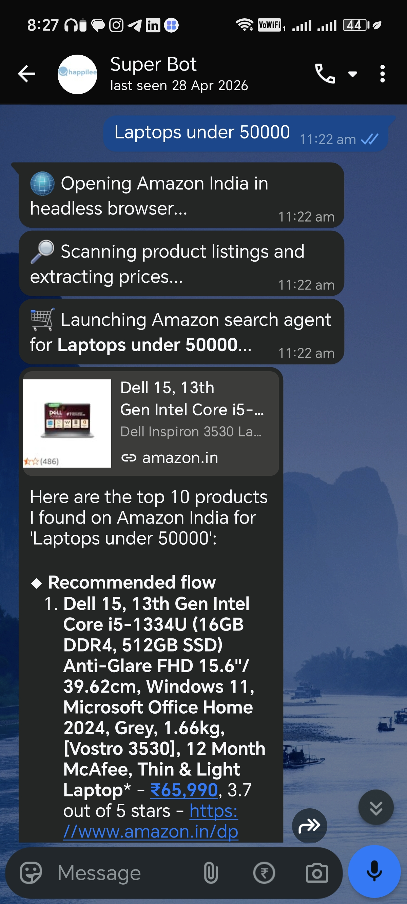
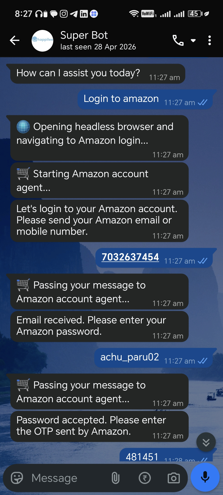
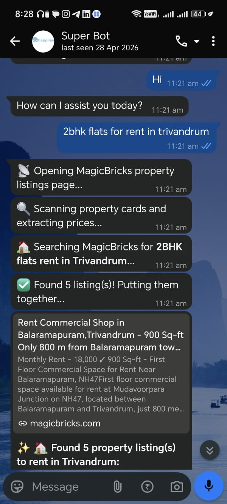
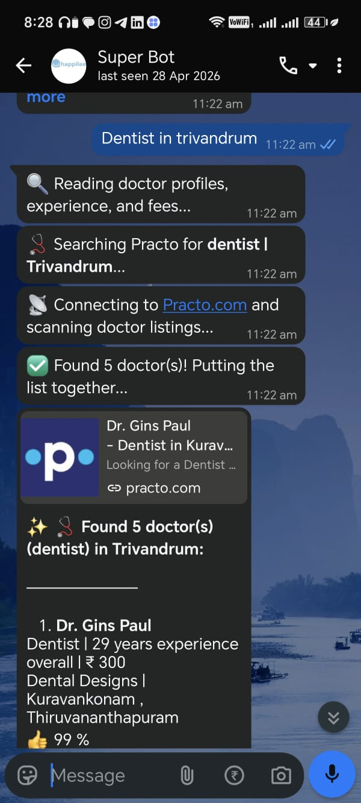
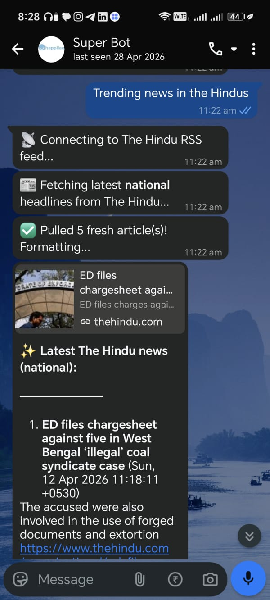
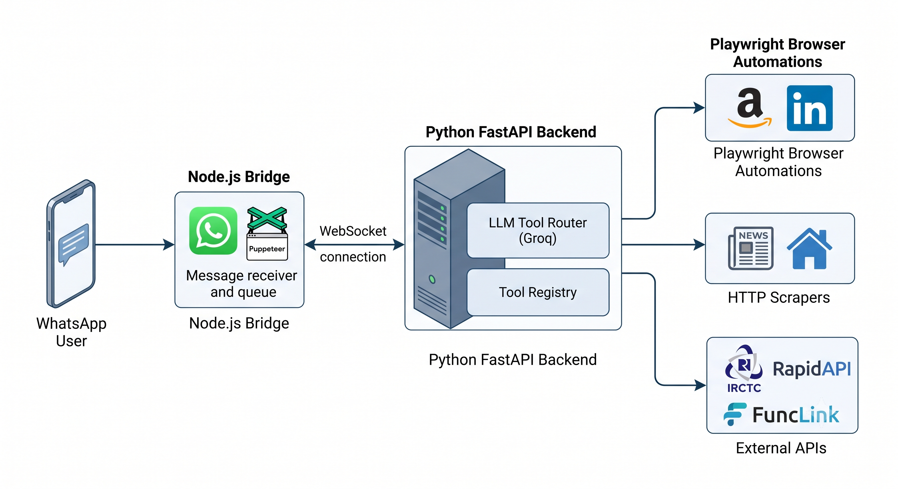
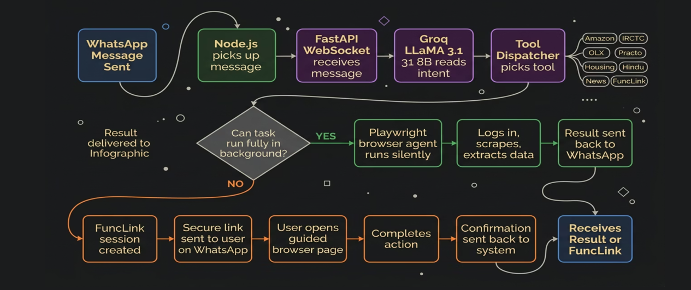

<div align="center">

# 👻 Ghost Operator

### AI-Powered WhatsApp Browser Agent

**Text it. It does the web work for you.**

Ghost Operator is a full-stack AI assistant that lives inside WhatsApp. Send it a natural-language message and it silently opens real browsers, logs into accounts, scrapes live data, and replies with results — all without you leaving the chat.

<br/>

[](https://fastapi.tiangolo.com/)
[](https://nodejs.org/)
[](https://playwright.dev/)
[](https://groq.com/)

</div>

---

## 🎯 What is Ghost Operator?

Most AI assistants answer questions from training data. **Ghost Operator acts on the live web.**

When you message it on WhatsApp, the Groq-powered LLM interprets your intent, selects the right tool, and dispatches a real Playwright browser or HTTP scraper to go get what you need. The result comes back as a clean, formatted WhatsApp reply — with links, prices, doctor details, property listings, or news headlines, all sourced live.

> **No app to install. No dashboard to learn. Just WhatsApp.**

---

## 📱 See It In Action

### 🛒 Amazon — Search Products & Login to Your Account

Ghost Operator searches Amazon live in a headless browser and returns real product listings with prices and ratings. It can also walk you through a full Amazon login — email, password, OTP — entirely over WhatsApp, with the browser running silently in the background.

<p align="center">
  
  &nbsp;&nbsp;&nbsp;
  
</p>
<p align="center">
  <em>Left: Searching "Laptops under ₹50,000" — returns live Amazon results with prices and links. &nbsp;|&nbsp; Right: Multi-turn guided Amazon login over WhatsApp.</em>
</p>

---

### 🏠 Property Listings, 🧑‍⚕️ Doctor Search & 📰 Live News

From finding 2BHK flats for rent in your city to locating dentists with fees and experience — Ghost Operator scrapes the right platform and replies with a clean, structured list. It also pulls live headlines from The Hindu's RSS feeds across 20+ news sections.

<p align="center">
  
  &nbsp;
  
  &nbsp;
  
</p>
<p align="center">
  <em>Left: MagicBricks property search. &nbsp;|&nbsp; Middle: Practo doctor finder. &nbsp;|&nbsp; Right: The Hindu live headlines.</em>
</p>

---

## 🏗️ How It's Built

Ghost Operator is two services working in tandem:

| Layer | Technology | Role |
|---|---|---|
| **WhatsApp Bridge** | Node.js + whatsapp-web.js | Receives messages, manages per-sender queues, formats replies |
| **AI Backend** | Python FastAPI + Groq LLM | Routes intent, executes tools, generates responses |

### System Architecture

<p align="center">
  
</p>

The Node.js bridge is a **thin adapter** — it handles authentication and queuing. All intelligence lives in the Python layer: the LLM picks the tool, the tool runs, and the result comes back through the same WebSocket.

### Message Flow

<p align="center">
  
</p>

**Step by step:**

1. **You send a WhatsApp message** — e.g. *"Find me 2BHK flats for rent in Bangalore under ₹30,000"*
2. The **Node.js bridge** enqueues it (concurrency 1, rate-limited at 2/sec) and sends it via a persistent WebSocket to the Python backend.
3. The **FastAPI backend** adds it to your per-sender chat history and calls the **LLM tool router**.
4. **Groq LLaMA 3.1** reads your intent and returns a JSON decision: `{ use_tool, tool, params }`.
5. The selected **tool executes** — a Playwright browser opens, or an HTTP scraper runs, or an API is called.
6. The raw result is passed back to the LLM, which generates a **WhatsApp-friendly reply**.
7. The Node.js bridge **chunks the reply** (≤ 3200 chars each) and delivers it to your chat.

---

## 🛠️ Available Tools

All tools live in a **self-registering plugin registry** (`tool_registry/`). Adding a new tool is as simple as dropping a Python file in `tools/` that calls `register_tool()` at module level.

| Tool | What It Does |
|---|---|
| 🛒 **Amazon Search** | Launches a Playwright browser, searches Amazon India, returns product names, prices, ratings, and direct links. |
| 🔑 **Amazon Account** | Guides a multi-turn Amazon login over WhatsApp (email → password → OTP). Uses a dedicated `ProactorEventLoop` daemon thread to keep the browser session alive across conversation turns. |
| 🏠 **MagicBricks Properties** | Scrapes MagicBricks for rental or sale listings by city, BHK type, and price range. |
| 🧑‍⚕️ **Practo Doctors** | Scrapes Practo via `requests` + `BeautifulSoup` for doctors by speciality, city, and locality. Ranks results by keyword relevance. |
| 💼 **LinkedIn Leads** | Runs Playwright-driven public LinkedIn people searches, returning names, headlines, and profile URLs. |
| 🚆 **IRCTC Train Status** | Fetches live train availability and PNR status via RapidAPI. Falls back automatically to DuckDuckGo-based scraping of trusted third-party portals if the API is unavailable. |
| 📰 **The Hindu News** | Pulls live headlines from The Hindu's RSS feeds. Supports 20+ sections: national, business, sport, technology, and more. |
| 🔗 **FuncLink Guide** | For tasks too complex to automate fully (hotel bookings, form submissions), calls the [FuncLink](https://funclinkbackend-production.up.railway.app/) service to generate a **guided browser session URL** and sends it to the user over WhatsApp. When the user completes the session, a webhook fires back and Ghost Operator confirms completion in the chat. |

---

## 🗂️ Project Structure

```
ghost_operator_browser_agent/
│
├── app/                              # Python FastAPI backend
│   ├── main.py                       # Entry point, sets ProactorEventLoopPolicy
│   ├── requirements.txt
│   │
│   ├── api/
│   │   ├── ws.py                     # /ws/{sender} — LLM-routed main endpoint
│   │   ├── housing_ws.py             # /ws/housing — MagicBricks interactive session
│   │   ├── hindu_ws.py               # /ws/hindu/news — The Hindu RSS
│   │   ├── irctc_ws.py               # /ws/irctc — IRCTC train/PNR
│   │   ├── linkedin_ws.py            # /ws/olx — OLX India listings
│   │   └── practo_ws.py              # /ws/practo — Practo doctor finder
│   │
│   ├── services/
│   │   ├── llm_service.py            # Groq API wrapper
│   │   ├── memory_service.py         # Per-sender in-memory chat history
│   │   ├── funclink_service.py       # FuncLink API client
│   │   ├── irctc_live_service.py     # IRCTC RapidAPI client
│   │   └── irctc_browser_service.py  # Playwright fallback for IRCTC
│   │
│   └── tool_registry/
│       ├── registry.py               # Central TOOL_REGISTRY dict
│       ├── executor.py               # execute_tool() async dispatcher
│       ├── __init__.py               # Auto-imports all tools on startup
│       └── tools/
│           ├── amazon_account.py
│           ├── amazon_search.py
│           ├── housing_listings.py
│           ├── linkedin_leads.py
│           └── practo_doctors.py
│
├── node-app/                         # Node.js WhatsApp bridge
│   └── src/
│       ├── index.js                  # Entry point
│       ├── whatsapp/
│       │   ├── client.js             # whatsapp-web.js client with QR auth
│       │   └── messageFormatter.js  # Chunking, callouts, emoji formatting
│       ├── websocket/
│       │   ├── wsManager.js          # Per-sender persistent WS + auto-reconnect
│       │   └── queueManager.js       # p-queue (concurrency 1, 2 msg/sec)
│       └── handlers/
│           └── messageHandler.js     # Routes WhatsApp → WebSocket → reply
│
└── assets/                           # Screenshots and diagrams
```

---

## ⚡ Quick Start

### Prerequisites

- Python 3.11+
- Node.js 18+
- A Groq API key ([get one free](https://console.groq.com/))
- A WhatsApp number to link as the bot

### 1. Start the Python Backend

```bash
cd app

# Create virtual environment
python -m venv .venv
source .venv/bin/activate        # Windows: .venv\Scripts\activate

# Install dependencies
pip install -r requirements.txt
playwright install chromium

# Configure environment
cp .env.example .env
# Edit .env — at minimum set GROQ_API_KEY

# Start server
uvicorn main:app --host 0.0.0.0 --port 8000 --reload
```

### 2. Start the WhatsApp Bridge

```bash
cd node-app

npm install

# Create node-app/.env:
echo "WS_BASE_URL=ws://localhost:8000/ws" > .env
echo "HEADLESS=false" >> .env

npm start
```

On first run, a **QR code** appears in the terminal. Scan it with WhatsApp (`Settings → Linked Devices → Link a Device`). Your session is saved locally in `.wwebjs_auth/` and reused on subsequent startups.

### 3. Test the API Directly

```bash
# Health check
curl http://localhost:8000/

# Test a tool directly (no WhatsApp needed)
curl -X POST http://localhost:8000/test/tool \
  -H "Content-Type: application/json" \
  -d '{"tool": "practo_doctors", "params": {"city": "Bangalore", "speciality": "dentist", "limit": 3}}'
```

---

## ⚙️ Environment Variables

### Python Backend (`app/.env`)

| Variable | Required | Description |
|---|---|---|
| `GROQ_API_KEY` | ✅ Yes | Groq API key for LLM inference |
| `MODEL_NAME` | No | Groq model (default: `llama-3.1-8b-instant`) |
| `IRCTC_RAPIDAPI_KEY` | No | RapidAPI key for live IRCTC data; falls back to web scraping if absent |
| `AMAZON_STORAGE_STATE_B64` | No | Base64-encoded Playwright storage state for pre-authenticated Amazon sessions |

### Node.js Bridge (`node-app/.env`)

| Variable | Required | Description |
|---|---|---|
| `WS_BASE_URL` | No | Python backend WebSocket URL (default: `ws://localhost:8000/ws`) |
| `HEADLESS` | No | Run Puppeteer headless — requires pre-existing `.wwebjs_auth/` session |

---

## 🔌 API Reference

### WebSocket Endpoints

| Path | Description |
|---|---|
| `/ws/{sender}` | **Main endpoint.** Accepts `{ "message": "..." }`, returns `{ "reply": "..." }`. LLM-routed. |
| `/ws/housing` | Interactive MagicBricks session (prompts for city, budget, BHK). |
| `/ws/hindu/news` | Interactive news session (prompts for section and count). |
| `/ws/irctc` | Interactive IRCTC session (auto-detects train search vs. PNR). |
| `/ws/olx` | Interactive OLX listings session. |
| `/ws/practo` | Interactive Practo doctor session. |

### REST Endpoints

| Method | Path | Description |
|---|---|---|
| `GET` | `/` | Health check → `{ "status": "ok" }` |
| `POST` | `/webhook/funclink` | Receives FuncLink session-complete callbacks and pushes confirmation to user's WhatsApp. |
| `POST` | `/test/tool` | Direct tool execution for testing. Payload: `{ "tool": "...", "params": {...} }` |

---

## 🪟 Windows Notes

Playwright on Windows requires a `ProactorEventLoop`, incompatible with Uvicorn's default `SelectorEventLoop`. Ghost Operator handles this automatically via two strategies:

1. **`main.py`** calls `asyncio.set_event_loop_policy(asyncio.WindowsProactorEventLoopPolicy())` before startup.
2. **Stateful tools** (like Amazon account sessions) run in dedicated background daemon threads with their own persistent `ProactorEventLoop`, dispatching coroutines via `run_coroutine_threadsafe`.

---

<div align="center">
  <br/>
  <p>Built with FastAPI · whatsapp-web.js · Playwright · Groq LLaMA 3</p>
</div>
